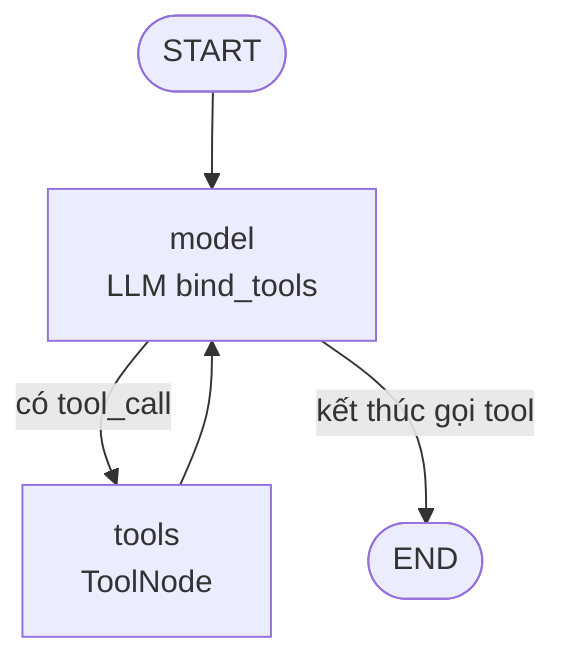
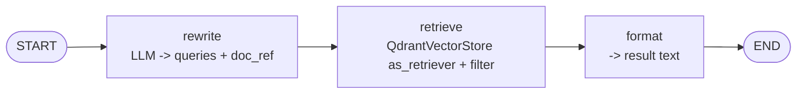

# Tài liệu: Main Agent (Supervisor) + Subagents (`agents/`) + Retrieval (`retrieval/`)

Hệ thống trả lời câu hỏi pháp luật dạng **agentic RAG**: một **Supervisor**
(main agent) trò chuyện với người dùng, delegate việc tìm kiếm cho **subagent**
`tra_cuu_van_ban`, rồi tổng hợp câu trả lời có dẫn chiếu văn bản.

- `agents/` — Supervisor + subagents (mỗi subagent là một **StateGraph riêng**).
- `retrieval/` — layer tra cứu Qdrant dùng **langchain-qdrant** (`as_retriever`
  chuẩn langchain); reranker dự kiến bổ sung sau.

```
agents/
  __init__.py            # docstring (KHÔNG import eager để tránh vòng import)
  main_agent.py          # Supervisor: StateGraph tường minh + memory (InMemorySaver)
  config.py              # Settings từ .env (python-dotenv), get_settings()
  llm.py                 # make_chat_model() -> ChatNVIDIA
  prompts.py             # system prompt + QUERY_REWRITER_PROMPT + format kết quả
  subagents/
    __init__.py          # re-export BaseSubAgent, REGISTRY, get_tools
    base.py              # BaseSubAgent: contract Pydantic + build_graph -> tool
    retriever.py         # QueryRewriteRetrieveSubAgent "tra_cuu_van_ban" (graph 3 node)
    registry.py          # REGISTRY -> get_tools()

retrieval/
  __init__.py            # re-export ChunkHit, Retriever
  embeddings.py          # MiniLMEmbeddings (langchain Embeddings, 384-d)
  store.py               # create_vector_store(<> QdrantVectorStore)
  models.py              # ChunkHit (dataclass dùng chung)
  retriever.py           # Retriever: as_retriever() (VectorStoreRetriever) + gộp/dedup
```

---

## 1. Vai trò, đầu vào / đầu ra

| | |
|---|---|
| **Đầu vào** | Câu hỏi tiếng Việt (CLI `python -m agents.main_agent` hoặc `MainAgent().chat()`) |
| **Đầu ra** | Câu trả lời text có dẫn chiếu số hiệu văn bản / điều / khoản + nguồn đã dùng |
| **Nguồn tri thức** | Collection Qdrant `vpl_chunks` (1104 điểm, 384 chiều, COSINE) |
| **Điều kiện** | `.env` có `NVIDIA_API_KEY` (hoặc `LLM_BASE_URL` + `LLM_API_KEY`); Qdrant đang chạy (`docker compose up -d`) |

---

## 2. Kiến trúc tổng quan

### 2.1 Supervisor — graph tường minh (không dùng `create_agent`)

`agents/main_agent.py` dựng `StateGraph` bằng langgraph trực tiếp:



- **`model`** node: `LLM.bind_tools(get_tools())` + `MAIN_SYSTEM_PROMPT`. Trả lời
  trực tiếp hoặc phát ra `tool_calls`.
- **`tools`** node: `ToolNode` thực thi tool. Mỗi tool = 1 **subagent StateGraph**
  (bọc qua `BaseSubAgent.to_tool()`).
- Cạnh: `START → model`; `model → tools` (nếu có tool_call) / `model → END`;
  `tools → model` (vòng lặp tới khi LLM ngừng gọi tool).

### 2.2 Subagent — mỗi subagent là một graph riêng

Subagent `tra_cuu_van_ban` là `StateGraph` 3 node:



Contract với Supervisor bằng **Pydantic** (`input_schema` / `output_schema`),
expose dưới dạng `StructuredTool` (xem mục 3.5, 3.6). Thêm subagent mới -> thêm 1
file trong `subagents/`, đăng ký vào `REGISTRY` -> tool tự xuất hiện, **không
sửa Supervisor**.

---

## 3. Từng file / class

### 3.1 `agents/config.py`
- `load_dotenv(ROOT / ".env", override=False)` bằng **python-dotenv** (không tự
  viết lại).
- Giá trị `"EMPTY"` / rỗng -> được chuẩn hóa thành `""`.
- `Settings` (frozen dataclass) + `load_settings()` / `get_settings()` (singleton).

| Biến env | Mặc định | Ý nghĩa |
|---|---|---|
| `LLM_BASE_URL` | (trống) | NVIDIA NIM tự host OpenAI-compatible; trống = dùng NVIDIA API Catalog |
| `LLM_API_KEY` | (trống) | Key NIM/vLLM (trống + có base_url -> tự dùng `"EMPTY"`) |
| `NVIDIA_API_KEY` | (trống) | Key NVIDIA API Catalog (chế độ mặc định) |
| `OPENAI_LLM_MODEL` | (bắt buộc) | Model chính — VD `openai/gpt-oss-20b` |
| `OPENAI_SUBAGENT_MODEL` | (trống) | Model riêng subagent rewrite; trống = chung model chính |
| `QDRANT_URL` | `http://localhost:6333` | Địa chỉ Qdrant |
| `QDRANT_API_KEY` | (trống) | Chỉ cần cho Qdrant Cloud |
| `QDRANT_COLLECTION` | `vpl_chunks` | Collection đã ingest |
| `EMBEDDING_MODEL` | `sentence-transformers/paraphrase-multilingual-MiniLM-L12-v2` | Model nhúng query — **phải khớp index** |
| `RETRIEVE_TOP_K` | `6` | Số chunk trả về |
| `TIMEOUT_SEC` | `120` | Timeout gọi LLM |
| `SYSTEM_PROMPT` | (mặc định trong code) | Override system prompt main agent |

### 3.2 `agents/llm.py`
- `make_chat_model(model=None, temperature=1.0, top_p=1.0, max_tokens=4096)`
  -> `ChatNVIDIA` (langchain_nvidia_ai_endpoints).
- `max_completion_tokens=max_tokens`; có `base_url` nếu `LLM_BASE_URL`.
- Key ưu tiên: `NVIDIA_API_KEY` -> `LLM_API_KEY` -> `OPENAI_API_KEY`.
  Thiếu cả base_url lẫn key -> `RuntimeError` kèm gợi ý `.env`.

### 3.3 `agents/prompts.py`
- `MAIN_SYSTEM_PROMPT` — vai trò trợ lý pháp lý, **luôn gọi tool
  `tra_cuu_van_ban` trước khi trả lời**, dẫn chiếu số hiệu/điều/khoản.
- `QUERY_REWRITER_PROMPT` — rewrite thành JSON `{"queries": [...], "doc_ref": "..."}`.
- `format_search_result(hits, doc_ref)` — in kết quả tra cứu thành text có cấu
  trúc cho main agent.

### 3.4 `retrieval/` — layer tra cứu (dùng langchain-qdrant)

Tham khảo tài liệu chính thức:
https://docs.langchain.com/oss/python/integrations/vectorstores/qdrant

- **`embeddings.py`** — `MiniLMEmbeddings(Embeddings)`: bọc SentenceTransformer
  thành langchain `Embeddings` (lazy-load, `normalize_embeddings=True`,
  384 chiều). Khớp model dựng index.
- **`store.py`** — `create_vector_store()` -> `QdrantVectorStore` bằng
  `from_existing_collection` với `retrieval_mode=RetrievalMode.DENSE`
  (không upsert document). Có sẵn `create_vector_store_from_documents()` cho
  test/rebuild.
- **`models.py`** — `ChunkHit` (dataclass dùng chung: `chunk_id`, `score`,
  `text`, `doc_ref`, `title`, `path`).
- **`retriever.py`** — `Retriever.search(queries, doc_ref=None, top_k=None)`:
  1. Dựng 1 `VectorStoreRetriever` qua `store.as_retriever(
     search_type="similarity", search_kwargs={"k": top_k, "filter": ...})`.
  2. `doc_ref` được chặn **ngay ở Qdrant** bằng `filter` (`metadata.title`
     MatchText) — không post-filter trong Python.
  3. Với mỗi query -> `retriever.invoke(query)` trả `list[Document]`, map thành
     `ChunkHit` (`metadata.chunk_id/title/path`) rồi **gộp + dedup theo
     chunk_id** (giữ thứ tự query đầu), cắt về top_k.

  > Lưu ý: collection được upsert bởi langchain-qdrant nên payload là
  > `{page_content, metadata}`, không phải flat.

### 3.5 `agents/subagents/base.py` — `BaseSubAgent` (ABC)
- Thuộc tính: `name`, `description`, `input_schema: type[BaseModel]`,
  `output_schema: type[BaseModel]`.
- `build_graph()` (abstract) -> `CompiledStateGraph` (graph riêng của subagent).
- `run(**kwargs)` — `graph.invoke({kwargs})` -> validate theo `output_schema`.
- `to_tool()` — bọc thành `StructuredTool` với `args_schema=input_schema`,
  func chạy graph rồi `_render_output()` (mặc định `str(output)`, subagent có
  thể override để trả gọn `.result`).

### 3.6 `agents/subagents/retriever.py` — `QueryRewriteRetrieveSubAgent`
- `name = "tra_cuu_van_ban"`.
- State graph 3 node: **rewrite → retrieve → format** (xem sơ đồ mục 2.2).
- `RetrieverInput {query: str, conversation: str = ""}` /
  `RetrieverOutput {result: str, doc_ref: str, n_hits: int}`.
- `_rewrite_node` gọi `make_chat_model(self._model)` -> JSON queries+doc_ref
  (parse lỗi -> fallback dùng nguyên câu hỏi).
- `_retrieve_node` dùng `Retrieval.Retriever` (langchain-qdrant + filter).
- `_format_node` trả `result` (định dạng qua `format_search_result`).

### 3.7 `agents/subagents/registry.py`
- `REGISTRY: list[BaseSubAgent]` — hiện chỉ `QueryRewriteRetrieveSubAgent()`.
- `get_tools()` -> `[sub.to_tool() for sub in REGISTRY]`.
  Thêm subagent: tạo file + thêm instance vào đây, tool tự xuất hiện.

### 3.8 `agents/main_agent.py` — `MainAgent`
- `__init__(thread_id="default", checkpointer=None)`: `make_chat_model()` +
  `get_tools()`, `InMemorySaver` (mặc định), dựng StateGraph tường minh.
- `chat(text)` — invoke graph với `{"configurable": {"thread_id": ...}}`,
  trả về câu trả lời cuối.
- `get_graph()` — trả `CompiledStateGraph` (xoá → debug step).
- `history(thread_id=None)` — các message trong thread.
- `reset(thread_id=None)` — xóa bộ nhớ thread.
- CLI `main()`: chat vòng lặp, gõ `exit`/`quit`/`thoat`/`thoát` để thoát.

---

## 4. Cách chạy

1. Chạy Qdrant:
   ```
   docker compose up -d
   ```
2. Tạo `.env` từ `.env.example`: điền `NVIDIA_API_KEY` (hoặc `LLM_BASE_URL` +
   `LLM_API_KEY` cho NIM tự host), `OPENAI_LLM_MODEL=openai/gpt-oss-20b`.
3. Đã ingest collection `vpl_chunks` (xem `docs/ingest/`).
4. Chạy:
   ```
   python -m agents.main_agent                                  # chat tương tác
   ```
   Hoặc trong code:
   ```python
   from agents.main_agent import MainAgent
   agent = MainAgent()
   print(agent.chat("Thời hạn giải quyết tố cáo là bao nhiêu ngày?"))
   ```

---

## 5. Mở rộng

### Thêm subagent mới (không sửa Supervisor)
1. Tạo file `agents/subagents/xxx.py`, kế thừa `BaseSubAgent`:
   ```python
   class LuatVietSubAgent(BaseSubAgent):
       name = "tra_cuu_thuoc_tinh"
       description = "Tra cứu thuộc tính văn bản (hiệu lực, ngày ban hành...)."

       @property
       def input_schema(self) -> type[BaseModel]: ...
       @property
       def output_schema(self) -> type[BaseModel]: ...

       def build_graph(self) -> CompiledStateGraph:
           graph = StateGraph(...)   # graph riêng của subagent
           ...
           return graph.compile()
   ```
2. Thêm instance vào `REGISTRY` trong `agents/subagents/registry.py`.
3. Xong — tool mới tự xuất hiện cho Supervisor.

### Lưu ý
- Reranker chưa implement (file `retrieval/reranker.py` đã bị xóa); khi cần
  triển khai sẽ thêm module mới và đấu nối gộp nhiều query trong
  `Retriever.search`.

### Lưu ý
- Vector index dùng MiniLM 384-d; mọi subagent tra cứu phải dùng chung
  embedder (`retrieval/embeddings.py`) nếu không lệch không gian vector.
- Memory in-memory (`InMemorySaver`), mất khi dừng tiến trình.
- `agents/__init__.py` cố tình không import eager để tránh vòng import
  (`agents ⇄ retrieval`); luôn import trực tiếp từ mô-đun con.