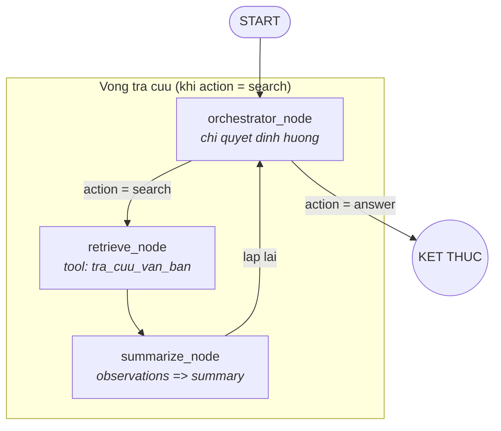

# Tài liệu: Agents (`agents/`)

Hệ thống trả lời câu hỏi pháp luật dạng **agentic RAG** theo pattern TimeNet:
**1 workflow duy nhất, 3 node** — orchestrator (chỉ quyết định), retrieve
(tra cứu), summarize (tổng hợp). **Tool thật** tập trung trong **một nơi**
(`tools.py`), hạ tầng/pipeline đỡ nằm ở `utils.py`; cơ chế **allowlist**: mỗi
node chỉ dùng đúng subset tools được khai báo.

```
agents/
  __init__.py            # docstring (KHÔNG import eager để tránh phụ thuộc vòng)
  config.py              # registry per-provider LLM + Settings từ .env (python-dotenv)
  llm.py                 # get_llm(provider, model, ...) dispatcher + get_llm_<provider>()
  embeddings.py          # get_embeddings() -> HuggingFaceEmbeddings (cache singleton)
  prompts.py             # ORCHESTRATOR_PROMPT + SUMMARY_PROMPT + QUERY_REWRITER_PROMPT
  state.py               # LegalQAState (Pydantic) + Analysis
  utils.py               # hạ tầng + pipeline tra cứu (KHÔNG phải tool): rewrite, retrieve, cache LLM/Qdrant, parse JSON
  tools.py               # NƠI CHỨA TOOL thật: tra_cuu_van_ban + TOOLS registry + get_tools()
  workflow.py            # graph: orchestrator --router--> retrieve -> summarize; CLI multi-turn
  visualize.py           # in mermaid/ascii + lưu docs/graphs/workflow.mmd
```

---

## 1. Vai trò, đầu vào / đầu ra

| | |
|---|---|
| **Đầu vào** | Câu hỏi tiếng Việt (CLI `python -m agents.workflow` hoặc `run_workflow(...)`) |
| **Đầu ra** | Câu trả lời text có dẫn chiếu số hiệu văn bản / điều / khoản |
| **Nguồn tri thức** | Collection Qdrant `vpl_chunks` (1104 điểm, 384 chiều, COSINE) |
| **Điều kiện** | `.env` có key provider (groq/nvidia) + model; Qdrant đang chạy (`docker compose up -d`) |

---

## 2. Kiến trúc tổng quan

### 2.1 Graph — 3 node



- **`orchestrator_node`** — LLM chạy phẳng (không `bind_tools`), nhận
  `[System(ORCHESTRATOR_PROMPT)] + state.messages` (list message LangChain thật;
  tin cuối = câu hỏi hiện tại). **Chỉ quyết định**: `search` → xuống retrieve,
  `answer` → trả lời thẳng (chào hỏi). **KHÔNG tự summarize**: khi đã có
  `summary` thì chỉ gán `answer = summary` và kết thúc.
- **`retrieve_node`** — retrieve agent: gọi **đúng** tool `tra_cuu_van_ban`
  (allowlist `RETRIEVE_NODE_TOOLS`), gom kết quả **thô** vào `observations`,
  giảm `early_stop_counter` (mặc định 3).
- **`summarize_node`** — LLM tổng hợp toàn bộ `observations` thành `summary`
  (bằng tiếng Việt, dẫn chiếu số hiệu/điều/khoản) rồi quay lại orchestrator.

Vòng lặp: `orchestrator → retrieve → summarize → orchestrator` lặp tới khi
orchestrator trả `action=answer` thì đi tới `END`. Giới hạn số vòng tra cứu
do `early_stop_counter` (tối đa 3) quản lý, chống lặp vô hạn.

> File sơ đồ tham chiếu (nếu cần ảnh): `docs/graphs/workflow.mmd` / `workflow.md`.

### 2.2 Multi-turn — messages + checkpointer built-in

Dùng cơ chế **built-in của LangGraph**, không format thủ công:

- State có field `messages: Annotated[list[AnyMessage], add_messages]` — lịch sử
  là **list message LangChain thật** (Human/AI xen kẽ), reducer tự nối thêm.
- **`MemorySaver()`** checkpointer persist toàn bộ state theo `thread_id`.
- `run_workflow(question, thread_id="default")`: câu hỏi nạp qua `HumanMessage`;
  gọi lại **cùng thread_id** → messages cũ tự khôi phục làm ngữ cảnh;
  **đổi thread_id** → bắt đầu hội thoại mới.

### 2.3 Nơi chứa tools + allowlist

Tách rõ 2 vai trò trong **2 file**:

- `utils.py` — hạ tầng + pipeline tra cứu (KHÔNG phải tool): cache LLM/Qdrant,
  rewrite query, truy vấn Qdrant, parse JSON.
- `tools.py` — chỉ khai báo **tool thật** + registry + allowlist.

| Hạng mục | Vị trí |
|---|---|
| Tool nguyên khối `tra_cuu_van_ban(query, conversation)` | `tools.py` — rewrite → retrieve → format (một lần gọi) |
| Hạ tầng + pipeline | `utils.py`: `rewrite_query`, `retrieve_docs`, `_doc_ref_filter`, `json_loads_object`, `get_rewrite_llm`, `get_store` |
| Registry | `tools.py: TOOLS: dict[str, BaseTool]` |
| Allowlist | `tools.py: get_tools(*names)`: rỗng = tất cả; tên lạ → `ValueError` |

Node dùng tool phải qua `get_tools(...)` với **tên liệt kê đích danh**:

```python
RETRIEVE_NODE_TOOLS = ("tra_cuu_van_ban",)
tool = get_tools(*RETRIEVE_NODE_TOOLS)[0]   # retrieve_node chỉ dùng đúng tool này
```

### 2.4 Cache (chống khởi tạo lại mỗi lượt)

| Thành phần | Cách cache | Vị trí |
|---|---|---|
| Embedding model | `@lru_cache(maxsize=1)` singleton | `embeddings.py:get_embeddings()` |
| LLM rewrite | `@lru_cache(maxsize=1)` | `utils.py:get_rewrite_llm()` |
| QdrantVectorStore | `@lru_cache(maxsize=1)` | `utils.py:get_store()` |

→ Embedder / Qdrant chỉ khởi tạo **1 lần / tiến trình**. `get_llm()` tạo object
LLM mỗi lượt là **rẻ** (không tải model, không network) nên không cần cache.

---

## 3. Từng file

### 3.1 `agents/config.py`
- `load_dotenv(ROOT / ".env", override=False)` bằng **python-dotenv**.
- `ProviderConfig.from_env(name)` — registry per-provider: đọc `{NAME}_API_KEY` /
  `{NAME}_BASE_URL` / `{NAME}_MODEL`. Thêm provider = thêm 1 entry vào `PROVIDERS`,
  **không** thêm field vào Settings.
- `_GENERIC` — fallback OpenAI-compatible chung (`LLM_API_KEY`, `LLM_BASE_URL`,
  `OPENAI_LLM_MODEL`) dùng khi nvidia không có key riêng.
- `Settings` + `get_settings()` singleton.

| Biến env | Mặc định | Ý nghĩa |
|---|---|---|
| `LLM_PROVIDER` | `nvidia` | Provider mặc định cho `get_llm()` |
| `NVIDIA_API_KEY` / `NVIDIA_MODEL` | (trống) | Provider NVIDIA |
| `GROQ_API_KEY` / `GROQ_MODEL` | (trống) | Provider Groq |
| `LLM_API_KEY` / `LLM_BASE_URL` / `OPENAI_LLM_MODEL` | (trống) | Fallback generic |
| `QDRANT_URL` / `QDRANT_API_KEY` | `localhost:6333` / (trống) | Qdrant |
| `QDRANT_COLLECTION` | `vpl_chunks` | Collection đã ingest |
| `EMBEDDING_MODEL` | MiniLM L12 v2 384-d | Model nhúng query — **phải khớp index** |
| `RETRIEVE_TOP_K` | `6` | Số chunk trả về |
| `TIMEOUT_SEC` | `120` | Timeout kết nối |

### 3.2 `agents/llm.py`
- `get_llm_nvidia(...)` / `get_llm_groq(...)` — tạo model từ `ProviderConfig`.
- `get_llm(provider=None, model=None, temperature=..., top_p=None, max_tokens=...)`
  — dispatcher: ưu tiên `provider` → mặc định `settings.llm_provider`.
  **Không suy đoán gì thêm** (`_MODEL_HINTS` đã xóa); provider lạ → `NotImplementedError`.
- `top_p` mặc định `None`: **chỉ truyền khi người gọi đích danh** — Groq không có
  tham số này (truyền sẽ sinh warning), NVIDIA mới nhận.
- **Không có wrapper** — mọi nơi gọi thẳng `get_llm(...)`.
- Groq thiếu model (không `GROQ_MODEL`) → `ValueError` nhắc rõ.

### 3.3 `agents/state.py`
- `Analysis` (Pydantic): `action`, `reasoning`, `new_query`.
- `LegalQAState` (Pydantic BaseModel): `question`, `messages` (list message
  LangChain, reducer `add_messages`), `analysis: Analysis` (`default_factory`),
  `observations: list[str]`, `summary: str`, `answer`, `early_stop_counter: int = 3`.

### 3.4 `agents/prompts.py`
- `ORCHESTRATOR_PROMPT` — LLM phẳng: **chỉ quyết định** search/answer (không
  tổng hợp). Trả JSON.
- `SUMMARY_PROMPT` — tổng hợp observations → câu trả lời hoàn chỉnh (dẫn chiếu
  số hiệu/điều/khoản, không bịa).
- `QUERY_REWRITER_PROMPT` — rewrite query trong pipeline tra cứu (trả JSON).

### 3.5 `agents/tools.py` + `agents/utils.py`
- `utils.py` — hạ tầng + pipeline (KHÔNG phải tool):
  - Cache: `get_rewrite_llm`, `get_store` (QdrantVectorStore) — `@lru_cache`,
    kết nối **1 lần / tiến trình**.
  - Pipeline: `rewrite_query` (1 query + `doc_ref`, fallback nguyên câu hỏi),
    `retrieve_docs` (Qdrant `as_retriever`, filter `doc_ref` bằng `MatchText`
    trên `metadata.title`, dedup theo `chunk_id`, cắt `top_k`).
  - `json_loads_object` (trích object JSON từ chuỗi LLM), `_doc_ref_filter`.
- `tools.py` — chỉ TOOL thật + registry:
  - `tra_cuu_van_ban(query, conversation)` — gói rewrite → retrieve → format,
    trả text có cấu trúc.
  - `RetrievalInput` (args schema), `TOOLS` registry, `get_tools(*names)`.

### 3.6 `agents/workflow.py`
- Node module-level: `orchestrator_node`, `retrieve_node`, `summarize_node`,
  `router`.
- `workflow()` → compile `StateGraph(LegalQAState)` với
  `MemorySaver(serde=JsonPlusSerializer(allowed_msgpack_modules=[("agents.state", "Analysis")]))`
  — đăng ký type custom `Analysis` để tránh warning "unregistered type"
  (cache `lru_cache` để không compile lại mỗi lượt gọi).
- `run_workflow(question, thread_id="default")` → `(answer, messages)`.
- `main()` — CLI multi-turn: `python -m agents.workflow`.

---

## 4. Cách chạy

1. Chạy Qdrant: `docker compose up -d`.
2. Tạo `.env` (điền `LLM_PROVIDER`, key + `*_MODEL` cho provider dùng,
   config Qdrant). Đã ingest collection `vpl_chunks`.
3. Chạy:
   ```
   python -m agents.workflow                      # chat tương tác (multi-turn)
   python -m agents.visualize --outdir docs/graphs # vẽ graph
   python test/test_llm.py                        # unit test LLM
   python test/main_test.py                       # test workflow
   ```

> Lưu ý gọi `-m agents.<module>` (không có `.py`): cơ chế `-m` thêm thư mục
> root vào `sys.path` nên các import dạng `agents.*` tìm được. Chạy kiểu
> `python agents/workflow.py` sẽ fail `ModuleNotFoundError`.

---

## 5. Lưu ý, mở rộng

- **Multi-turn**: reducer `add_messages` + checkpointer `MemorySaver` theo
  `thread_id`; dừng tiến trình là mất memory. Muốn lưu lâu → đổi `SqliteSaver`.
- **Add tool mới**: viết pipeline/hàm phụ trợ trong `utils.py`; khai báo
  **tool thật** trong `tools.py` rồi đăng ký vào `TOOLS`; node muốn dùng
  khai báo tên trong tuple allowlist của node đó.
- **Add node mới**: node = hàm module-level nhận/trả `LegalQAState` (mutation
  cũng hợp lệ), đăng ký trong `workflow()`.
- **Vector index MiniLM 384-d**: mọi tra cứu bắt buộc dùng chung
  `get_embeddings()` để không lệch không gian vector.
- **`agents/__init__.py` cố tình không import eager** (docstring), tránh các
  import nặng (model/Qdrant) khi chỉ cần config.
- **Reranker** chưa implement; khi cần, thêm bước sau `retrieve` trong pipeline
  `tra_cuu_van_ban`.