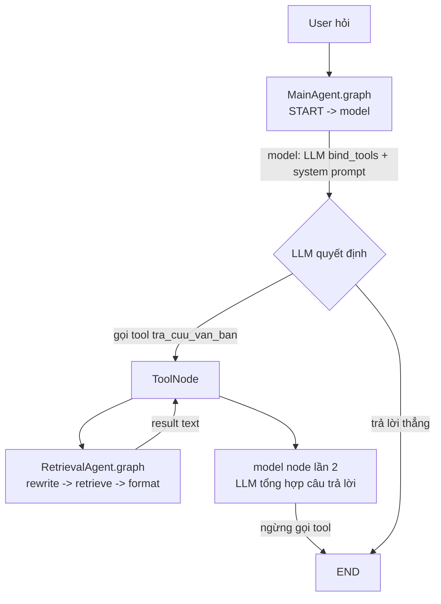
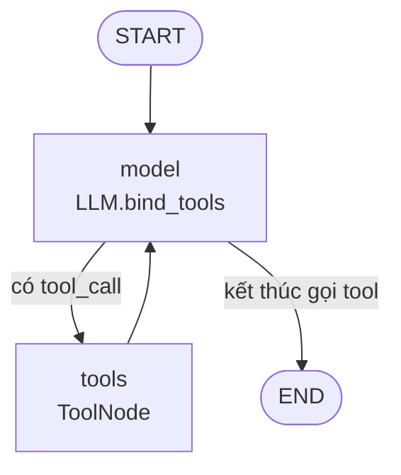
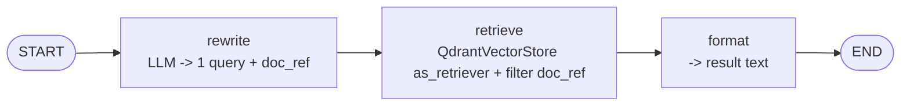

# Tài liệu: Agents (`agents/`)

Hệ thống trả lời câu hỏi pháp luật dạng **agentic RAG** gồm **2 graph độc lập,
mỗi graph có state riêng**:

- `MainAgent` (supervisor) — graph chính, state `MessagesState` (lịch sử hội
  thoại + checkpointer `InMemorySaver`).
- `RetrievalAgent` (subagent) — graph con **rewrite → retrieve → format**, state
  riêng `RetrievalState`, được expose cho main agent dưới dạng tool
  `tra_cuu_van_ban` (`StructuredTool`).

```
agents/
  __init__.py            # docstring (KHÔNG import eager để tránh phụ thuộc vòng)
  config.py              # Settings từ .env (python-dotenv) + get_settings() singleton
  llm.py                 # make_chat_model() -> ChatNVIDIA
  embeddings.py          # get_embeddings() -> HuggingFaceEmbeddings (cache singleton)
  prompts.py             # MAIN_SYSTEM_PROMPT + QUERY_REWRITER_PROMPT + format_search_result
  main_agent.py          # MainAgent: graph supervisor + CLI `python -m agents.main_agent`
  retrieval_agent.py     # RetrievalAgent: graph rewrite->retrieve->format + to_tool()
```

---

## 1. Vai trò, đầu vào / đầu ra

| | |
|---|---|
| **Đầu vào** | Câu hỏi tiếng Việt (CLI `python -m agents.main_agent` hoặc `MainAgent().chat()`) |
| **Đầu ra** | Câu trả lời text có dẫn chiếu số hiệu văn bản / điều / khoản + nguồn đã dùng |
| **Nguồn tri thức** | Collection Qdrant `vpl_chunks` (1104 điểm, 384 chiều, COSINE) |
| **Điều kiện** | `.env` có `NVIDIA_API_KEY` (hoặc `LLM_BASE_URL` + `LLM_API_KEY`); Qdrant đang chạy (`docker compose up -d`) |

---

## 2. Kiến trúc tổng quan

### 2.1 Luồng chạy tổng thể (end-to-end)



### 2.2 Main agent — graph tường minh (`agents/main_agent.py`)

Không dùng `create_agent`, dựng `StateGraph(MessagesState)` trực tiếp:



- **`model`** node (`call_model`): `LLM.bind_tools(tools)` + `MAIN_SYSTEM_PROMPT`
  + lịch sử messages → trả lời trực tiếp hoặc phát `tool_calls`.
- **`tools`** node: `ToolNode` thực thi tool. Tool duy nhất = graph con
  `RetrievalAgent` (bọc `StructuredTool`).
- Cạnh: `START → model`; `model --tools_condition--> tools` (nếu có tool_call)
  hoặc `END`; `tools → model` (vòng lặp tới khi LLM ngừng gọi tool).
- Checkpointer: `InMemorySaver()` — lịch sử hội thoại giữ theo `thread_id`
  (mặc định `"default"`), hỗ trợ **hỏi tiếp nhiều lượt (multi-turn)**.

### 2.3 Retrieval agent — graph con (`agents/retrieval_agent.py`)

State riêng `RetrievalState {query, conversation, queries, doc_ref, docs, result}`
và 3 node tuần tự:



- **`rewrite`** (`_rewrite`): gọi LLM (`_get_rewrite_llm`, temperature 0.0) với
  `QUERY_REWRITER_PROMPT` → parse JSON `{"queries": ["..."], "doc_ref": "..."}`.
  Chỉ giữ **1** query. Lỗi parse / lỗi LLM → fallback dùng nguyên câu hỏi.
- **`retrieve`** (`_retrieve`): dùng `QdrantVectorStore` (`_get_store`, cache)
  + `as_retriever(search_type="similarity", search_kwargs={"k": top_k, "filter": ...})`.
  Có `doc_ref` → filter ngay ở Qdrant (`metadata.title` `MatchText` full-text).
  Gộp các query (hiện chỉ 1), **dedup theo `metadata.chunk_id`**, cắt về `top_k`.
- **`format`** (`_format`): `format_search_result(docs, doc_ref)` → chuỗi text
  có cấu trúc trả về main agent.

### 2.4 Cache (chống khởi tạo lại mỗi lượt)

| Thành phần | Cách cache | Vị trí |
|---|---|---|
| Embedding model | `@lru_cache(maxsize=1)` singleton | `embeddings.py:get_embeddings()` |
| LLM rewrite | `@lru_cache(maxsize=1)` | `retrieval_agent.py:_get_rewrite_llm()` |
| QdrantVectorStore | `@lru_cache(maxsize=1)` | `retrieval_agent.py:_get_store()` |

→ Load model / kết nối Qdrant **1 lần / tiến trình**, các lượt sau không
khởi tạo lại.

---

## 3. Từng file

### 3.1 `agents/config.py`
- `load_dotenv(ROOT / ".env", override=False)` bằng **python-dotenv**.
- `_clean(value)` — chuẩn hóa `"EMPTY"` / rỗng → `""`.
- `Settings` (frozen dataclass) + `Settings.load()` đọc toàn bộ biến.
- `get_settings()` — singleton (load 1 lần, dùng lại).

| Biến env | Mặc định | Ý nghĩa |
|---|---|---|
| `LLM_BASE_URL` | (trống) | NVIDIA NIM tự host OpenAI-compatible; trống = dùng NVIDIA API Catalog |
| `LLM_API_KEY` | (trống) | Key NIM/vLLM |
| `NVIDIA_API_KEY` | (trống) | Key NVIDIA API Catalog (chế độ mặc định) |
| `OPENAI_LLM_MODEL` | `openai/gpt-oss-20b` | Model chính |
| `OPENAI_SUBAGENT_MODEL` | (trống) | Model riêng subagent rewrite; trống = dùng chung model chính |
| `QDRANT_URL` | `http://localhost:6333` | Địa chỉ Qdrant |
| `QDRANT_API_KEY` | (trống) | Chỉ cần cho Qdrant Cloud |
| `QDRANT_COLLECTION` | `vpl_chunks` | Collection đã ingest |
| `EMBEDDING_MODEL` | `sentence-transformers/paraphrase-multilingual-MiniLM-L12-v2` | Model nhúng query — **phải khớp index** |
| `RETRIEVE_TOP_K` | `6` | Số chunk trả về |
| `TIMEOUT_SEC` | `120` | Timeout kết nối Qdrant / LLM |
| `SYSTEM_PROMPT` | (mặc định trong code) | Override system prompt main agent |

### 3.2 `agents/llm.py`
- `make_chat_model(model=None, temperature=1.0, top_p=1.0, max_tokens=4096)`
  → `ChatNVIDIA` (langchain_nvidia_ai_endpoints).
- Key ưu tiên: `NVIDIA_API_KEY` → `LLM_API_KEY` → `"EMPTY"`.
- Có `LLM_BASE_URL` → gửi `base_url` (NIM tự host); ngược lại → NVIDIA API Catalog.

### 3.3 `agents/embeddings.py`
- `get_embeddings()` (`@lru_cache(maxsize=1)`) → `HuggingFaceEmbeddings`
  (langchain_huggingface) bọc `SentenceTransformer` MiniLM 384-d.
- Cấu hình khớp index: `model_name` + `encode_kwargs={"normalize_embeddings": True}`.

### 3.4 `agents/prompts.py`
- `MAIN_SYSTEM_PROMPT` — trợ lý pháp lý, **luôn gọi tool `tra_cuu_van_ban`
  trước khi trả lời**, dẫn chiếu số hiệu/điều/khoản.
- `QUERY_REWRITER_PROMPT` — viết lại thành **1** câu truy vấn + trích `doc_ref`,
  trả JSON.
- `format_search_result(docs, doc_ref)` — in kết quả tra cứu thành text có cấu trúc.

### 3.5 `agents/retrieval_agent.py`
- `_get_rewrite_llm(model)` / `_get_store(...)` — cache module-level (mục 2.4).
- `RetrievalState` (TypedDict) — state riêng của graph con.
- `RetrievalInput` (Pydantic) — contract khi expose tool.
- `RetrievalAgent`:
  - `name = "tra_cuu_van_ban"`, `description` — mô tả cho LLM biết cách dùng.
  - `_build_graph()` — dựng graph 3 node (mục 2.3).
  - `_rewrite(state)` → `{queries, doc_ref}`; `_retrieve(state)` → `{docs}`;
    `_format(state)` → `{result}`.
  - `_doc_ref_filter(doc_ref)` — `Filter` với `MatchText(text=doc_ref)` trên
    `metadata.title`.
  - `run(query, conversation="")` → chạy graph, trả `result`.
  - `to_tool()` → `StructuredTool(args_schema=RetrievalInput, func=run)`.

### 3.6 `agents/main_agent.py`
- `MainAgent(model=None, system_prompt=None, thread_id="default",
  checkpointer=None, tools=None)`:
  - Tạo `RetrievalAgent().to_tool()` mặc định (hoặc nhận `tools` tuỳ chỉnh).
  - `make_chat_model(model)` → `bind_tools(tools)`.
  - `InMemorySaver()` mặc định (hoặc truyền `checkpointer` riêng).
- `chat(text, thread_id=None)` — gửi câu hỏi, trả câu trả lời cuối.
- `history(thread_id=None)` — các message trong thread.
- `reset(thread_id=None)` — xóa bộ nhớ thread (`delete_thread`).
- `main()` — CLI chat vòng lặp; gõ `exit` / `quit` / `thoát` / `thoat` để thoát.

---

## 4. Cách chạy

1. Chạy Qdrant: `docker compose up -d`.
2. Tạo `.env` từ `.env.example` (điền key NVIDIA / config Qdrant, model).
3. Đã ingest collection `vpl_chunks` (xem `docs/ingest/`).
4. Chạy:
   ```
   python -m agents.main_agent                       # chat tương tác (đa lượt)
   ```
   Hoặc trong code:
   ```python
   from agents.main_agent import MainAgent
   agent = MainAgent()
   print(agent.chat("Thời hạn giải quyết tố cáo là bao nhiêu ngày?"))
   ```

> Lưu ý gọi `-m agents.main_agent` (không có `.py`): cơ chế `-m` thêm thư mục
> root vào `sys.path` nên các import dạng `agents.*` tìm được. Chạy kiểu
> `python agents/main_agent.py` sẽ fail `ModuleNotFoundError` vì `sys.path`
> chỉ chứa `agents/`.

---

## 5. Lưu ý, mở rộng

- **Multi-turn**: checkpointer `InMemorySaver` lưu theo `thread_id`; trong cùng
  tiến trình, `agent.chat()` liên tiếp giữ được ngữ cảnh. Memory mất khi dừng
  tiến trình.
- **Add subagent mới**: tạo class graph riêng trong `agents/` (kiểu
  `RetrievalAgent`), có `run(**kwargs)` + `to_tool()`, rồi đưa vào
  `tool_list` khi khởi tạo `MainAgent(tools=[...])` (hoặc sửa default trong
  `__init__`). Không cần registry/ABC — mỗi subagent là một file đơn giản.
- **Vector index MiniLM 384-d**: mọi subagent tra cứu bắt buộc dùng chung
  `get_embeddings()` để không lệch không gian vector.
- **`agents/__init__.py` cố tình không import eager** (docstring), tránh các
  import nặng (model/Qdrant) khi chỉ cần config.
- **Reranker** chưa implement; khi cần, thêm bước sau `retrieve` và trước
  `format` trong graph con.