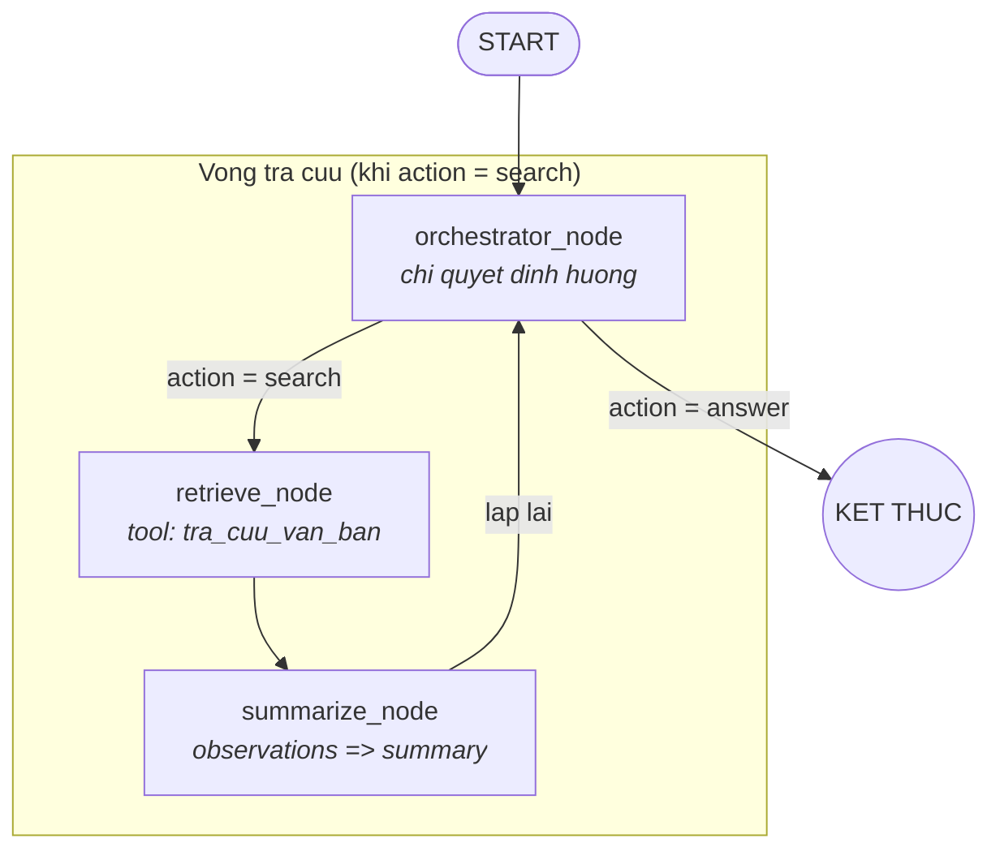

# Workflow graph

Sơ đồ tự vẽ (không dùng output của LangGraph), mở bằng Markdown Preview:
bấm `Ctrl+Shift+V` (Windows) hoặc chuột phải -> "Open Preview".

```mermaid
graph TD
    START([START]) --> ORCH["orchestrator_node<br/><i>chi quyet dinh huong</i>"]

    subgraph LOOP ["Vong tra cuu (khi action = search)"]
        ORCH -->|"action = search"| RET["retrieve_node<br/><i>tool: tra_cuu_van_ban</i>"]
        RET --> SUM["summarize_node<br/><i>observations => summary</i>"]
        SUM -->|"lap lai"| ORCH
    end

    ORCH -->|"action = answer"| FIN((KET THUC))
```