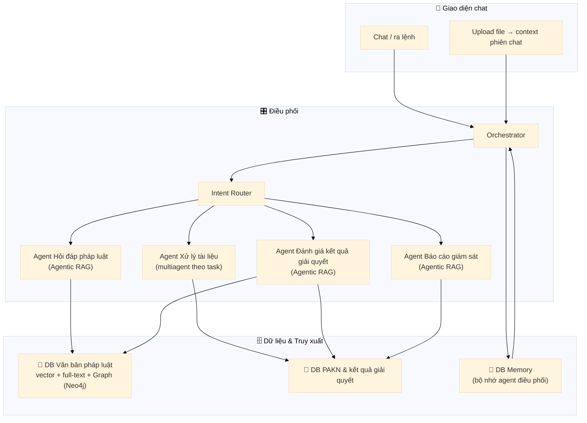
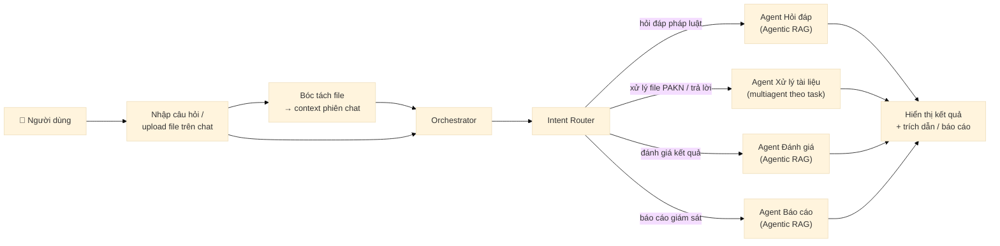
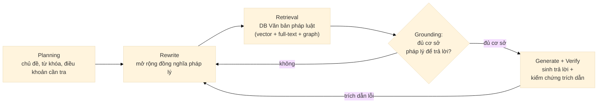
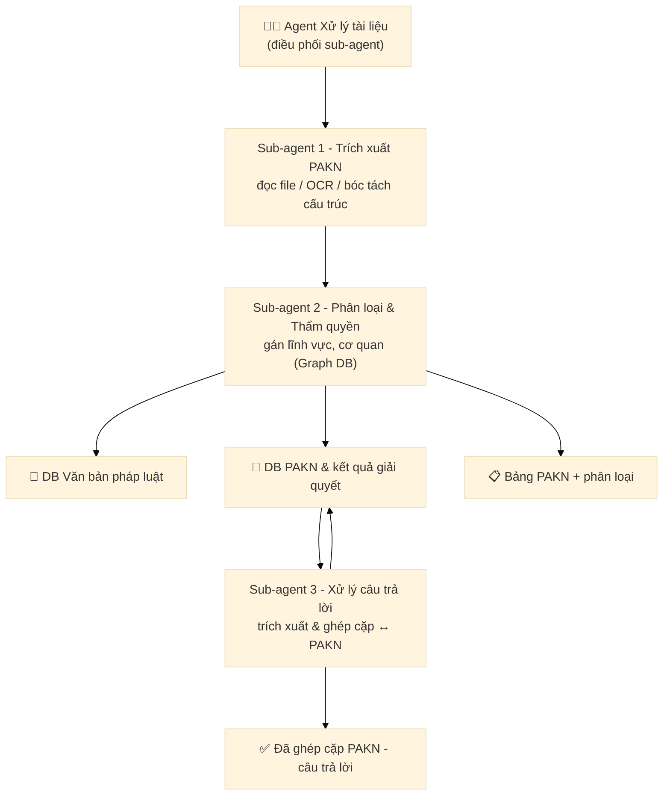
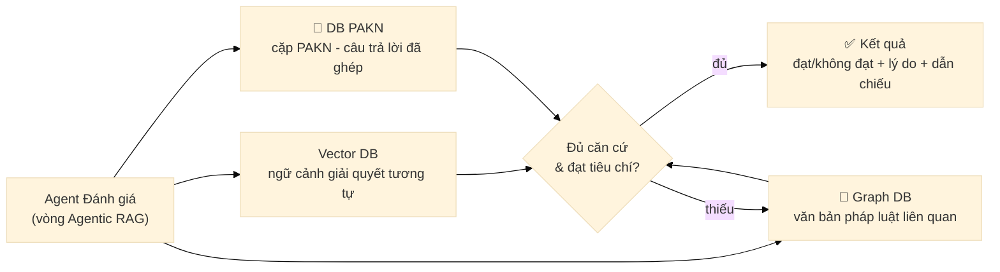
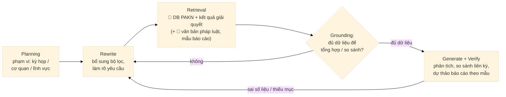

# Thiết kế Hệ thống QA Pháp luật Multi-Agent

## 1. Tổng quan

Chat **giống ChatGPT** cho lĩnh vực pháp luật Việt Nam, kiến trúc **multi-agent**. Người dùng **nhập câu hỏi** hoặc **upload file**; file đính kèm trở thành **context của phiên chat** để agent đọc và xử lý theo lệnh hội thoại (VD: *"trích xuất giúp file PAKN này"*).

Hai dạng luồng xử lý:
- **Agentic RAG** — dùng cho Agent **Hỏi đáp**, **Đánh giá**, **Báo cáo**.
- **Multiagent theo task** — dùng cho Agent **Xử lý tài liệu**: mỗi sub-agent làm đúng một task.

## 2. Kiến trúc tổng thể

**Dữ liệu:**
- **DB Văn bản pháp luật**: luật, nghị định, thông tư; chỉ mục **vector + full-text** và **Graph (Neo4j)** — Graph lưu quan hệ hiệu lực, sửa đổi/thay thế, cơ quan ban hành, thẩm quyền.
- **DB PAKN**: kiến nghị cử tri + kết quả giải quyết, kèm metadata (kỳ họp, lĩnh vực, cơ quan).
- **DB Memory (bộ nhớ agent điều phối)**: **chỉ Orchestrator có bộ nhớ** — lưu lịch sử phiên chat, ký ức dài hạn (sở thích, ngữ cảnh, kết quả đã xử lý), khôi phục qua các phiên để điều phối có ngữ cảnh. Các agent khác **không có bộ nhớ**: chạy kiểu stateless theo từng task, bộ nhớ **reset sau khi hoàn thành tác vụ**.

**Hybrid search** = truy vấn song song vector + full-text + Graph, **gom hạng (fusion/rerank)** rồi lọc bỏ văn bản hết hiệu lực trước khi đưa vào LLM với trích dẫn.

## 3. Luồng xử lý tổng thể

Các bước chính:

1. **Nhận yêu cầu**: người dùng nhập câu hỏi hoặc upload file qua thanh chat.
2. **Chuẩn bị context**: file được bóc tách thành text (PDF/Word/scan) và nạp vào context của phiên chat ngay trong lượt xử lý.
3. **Khôi phục memory**: Orchestrator truy vấn **DB Memory** để lấy lịch sử phiên và ký ức dài hạn (sở thích, kết quả trước đó), đưa vào context điều phối.
4. **Điều phối**: Orchestrator đưa yêu cầu (kèm context + memory) vào Intent Router.
5. **Định tuyến**: Router phân loại ý định thành 1 trong 4 nhánh → giao cho agent tương ứng.
6. **Xử lý tác vụ**: agent được triệu hồi chạy kiến trúc riêng (§5) — Agentic RAG hoặc luồng multiagent theo task; chạy **stateless, không ghi nhớ**: sau khi xong, bộ nhớ của agent **reset**, chỉ Orchestrator cập nhật kết quả vào DB Memory.
7. **Phản hồi**: kết quả hiển thị trên chat kèm trích dẫn điều khoản, bảng số liệu hoặc báo cáo (tải xuống/upload).

## 4. Mô tả chi tiết các tính năng

### 4.1 Tổng hợp tính năng

| Tính năng | Đầu vào | Đầu ra | Agent đảm nhận |
|-----------|---------|--------|----------------|
| Hỏi đáp pháp luật | Câu hỏi bằng text | Câu trả lời kèm trích dẫn điều khoản | Agent Hỏi đáp |
| Trích xuất PAKN | File PAKN (PDF/Word/scan) | Danh sách từng kiến nghị | Sub-agent 1 |
| Phân loại lĩnh vực & thẩm quyền | PAKN đã trích xuất | Gán lĩnh vực + cơ quan thẩm quyền | Sub-agent 2 |
| Trích xuất câu trả lời & ghép cặp | File văn bản trả lời của cơ quan | Cặp PAKN ↔ câu trả lời | Sub-agent 3 |
| Đánh giá câu trả lời | Cặp PAKN – câu trả lời | Điểm + nhận xét + dẫn chiếu | Agent Đánh giá |
| Báo cáo giám sát | Phạm vi kỳ họp / cơ quan / lĩnh vực | Dự thảo báo cáo + biểu đồ so sánh | Agent Báo cáo |

### 4.2 Hỏi đáp pháp luật

- **Mục đích**: trả lời thắc mắc về văn bản QPPL, nghị định, thông tư; hỗ trợ tra cứu văn bản còn hiệu lực.
- **Cách dùng**: gõ câu hỏi tự nhiên, VD *"Nghị định nào đang quy định về xử phạt vi phạm hành chính lĩnh vực môi trường?"*.
- **Đầu ra**: câu trả lời chia mục, mỗi luận điểm kèm trích dẫn `[Loại văn bản, số/ký hiệu, điều khoản]`; bấm vào trích dẫn để mở văn bản gốc.
- **Điểm nổi bật**: quay vòng truy xuất khi thiếu cơ sở; trả lời "không đủ cơ sở" thay vì bịa văn bản.

### 4.3 Trích xuất PAKN

- **Mục đích**: đọc file kiến nghị cử tri và tách thành từng kiến nghị riêng lẻ (keeps cấu trúc).
- **Cách dùng**: upload file PAKN lên chat, yêu cầu *"trích xuất giúp file này"*.
- **Đầu ra**: bảng danh sách kiến nghị (nội dung, người phản ánh, địa phương…).
- **Hỗ trợ**: PDF, Word, văn bản scan (OCR) và định dạng bảng/cấu trúc phức tạp.

### 4.4 Phân loại lĩnh vực & xác định cơ quan thẩm quyền

- **Mục đích**: gán nhãn lĩnh vực (đất đai, môi trường, y tế…) và xác định cơ quan có thẩm quyền giải quyết.
- **Cơ chế**: kết hợp LLM với truy vấn **Graph DB** (quan hệ cơ quan – lĩnh vực – thẩm quyền) để đảm bảo chính xác.
- **Đầu ra**: metadata gắn vào từng PAKN (lĩnh vực, cơ quan, kỳ họp) và được lưu vào DB PAKN.

### 4.5 Trích xuất câu trả lời & ghép cặp

- **Mục đích**: đọc văn bản trả lời của cơ quan, trích câu trả lời và **ghép cặp với PAKN** tương ứng.
- **Cơ chế ghép cặp**: đa tín hiệu — mã kiến nghị, cơ quan trả lời, nội dung/ngữ nghĩa (embedding); hỗ trợ xác nhận người dùng nếu nghi ngờ.
- **Đầu ra**: cập nhật "kết quả giải quyết" cho từng PAKN trong DB.

### 4.6 Đánh giá câu trả lời

- **Mục đích**: đánh giá mức độ phù hợp của câu trả lời với nội dung kiến nghị.
- **Cơ chế**: Agentic RAG — truy xuất văn bản pháp luật & ngữ cảnh tương tự để chấm điểm theo 5 tiêu chí (§5.3).
- **Đầu ra**: nhãn **Đạt / Không đạt** hoặc điểm 0–100 kèm lý do và dẫn chiếu; dữ liệu dùng cho báo cáo.

### 4.7 Sinh báo cáo giám sát

- **Mục đích**: tổng hợp kết quả giải quyết kiến nghị và so sánh qua các kỳ họp.
- **Cách dùng**: yêu cầu theo phạm vi, VD *"lập báo cáo giám sát kỳ họp 8"* hoặc chọn bộ lọc (giai đoạn, cơ quan, lĩnh vực).
- **Đầu ra**: dự thảo báo cáo theo mẫu chuẩn — tổng quan · phân tích theo lĩnh vực/cơ quan · biểu đồ so sánh liên kỳ · danh sách vấn đề đề xuất giám sát · phụ lục chi tiết (§5.4).
- **Điểm nổi bật**: hỗ trợ user chỉnh sửa, bổ sung trước khi trình Ủy ban Thường vụ Quốc hội.

## 5. Các agent (sau Intent Router)

Mỗi agent bên dưới được chạy khi Intent Router xác định yêu cầu thuộc phạm vi của nó.

### 5.1 Agent Hỏi đáp pháp luật — Agentic RAG

Trả lời câu hỏi về văn bản QPPL, nghị định kèm **trích dẫn điều khoản**. Agent tự chạy vòng lặp: lập kế hoạch truy vấn → viết lại query → truy xuất hybrid → kiểm tra đủ cơ sở → sinh trả lời → kiểm chứng trích dẫn; **quay vòng** khi thiếu cơ sở hoặc trích dẫn lỗi.

### 5.2 Agent Xử lý tài liệu — multiagent theo task

Nhận file từ context chat rồi **chia việc cho 3 sub-agent**:

1. **Trích xuất PAKN** — đọc file/OCR, bóc tách cấu trúc, tách từng kiến nghị.
2. **Phân loại & Thẩm quyền** — gán lĩnh vực, cơ quan có thẩm quyền (dựa trên Graph DB), lưu vào DB PAKN.
3. **Xử lý câu trả lời** — trích xuất câu trả lời của cơ quan, ghép cặp ↔ PAKN tương ứng (theo cơ quan, mã kiến nghị, ngữ nghĩa).

### 5.3 Agent Đánh giá câu trả lời — Agentic RAG

Tự truy xuất căn cứ pháp lý để **chấm điểm** mức phù hợp của câu trả lời với từng PAKN, quay vòng truy xuất khi chưa đủ căn cứ.

**Tiêu chí đánh giá:**

| Tiêu chí | Câu hỏi |
|----------|---------|
| Đúng trọng tâm | Câu trả lời có giải quyết đúng nội dung PAKN không? |
| Phù hợp thẩm quyền | Đơn vị trả lời có đúng cơ quan thẩm quyền? |
| Căn cứ pháp lý | Có dựa trên văn bản phù hợp, còn hiệu lực? |
| Mức xử lý | Giải quyết dứt điểm hay chung chung/né tránh? |
| Tính đầy đủ | Mọi kiến nghị đều được trả lời? |

### 5.4 Agent Báo cáo giám sát — Agentic RAG

Truy xuất DB PAKN + DB Văn bản pháp luật để **tổng hợp, phân tích kết quả giải quyết kiến nghị** và **so sánh tỷ lệ giải quyết qua các kỳ** họp, sinh **dự thảo báo cáo** trình Ủy ban Thường vụ Quốc hội.

**Nội dung báo cáo:** tổng quan (đã giải quyết / đang xử lý / chưa thỏa đáng) · phân tích theo lĩnh vực & cơ quan · so sánh tỷ lệ qua các kỳ · danh sách vấn đề đề xuất giám sát · phụ lục chi tiết từng PAKN kèm kết quả đánh giá (§3.3).

## 6. Hạ tầng & công nghệ

### 6.1 Stack công nghệ đề xuất

| Lớp | Lựa chọn chính | Thay thế | Ghi chú |
|-----|----------------|----------|---------|
| **LLM** | Groq (Llama 3.x / DeepSeek R1), NVIDIA AI Endpoints | GPT-4o, Claude Haiku, Gemini Flash | Tool calling + tiếng Việt tốt |
| **Embedding** | NVIDIA / BGE-m3 | Vietnamese embedding, `text-embedding-3` | Đánh giá trên dữ liệu pháp luật |
| **Vector DB** | Qdrant | Chroma, FAISS, Weaviate, Pinecone | Lưu chunk + embedding |
| **Graph DB** | Neo4j | — | Quan hệ hiệu lực, sửa đổi, thẩm quyền |
| **Full-text** | Elasticsearch | PostgreSQL FTS, OpenSearch | Khớp từ khóa chính xác |
| **Agent framework** | LangGraph + Deep Agents | OpenAI Agents SDK | Orchestrator, workflow, sub-agent |
| **Checkpoint / session** | SQLite (`langgraph-checkpoint-sqlite`, `aiosqlite`) | PostgreSQL | Lưu state, lịch sử phiên |
| **Memory store** | PostgreSQL (LangGraph Store / `deepagents` StoreBackend) | SQLite, Redis, mem0 | Chỉ **Orchestrator** dùng; các agent khác stateless, reset memory sau tác vụ |
| **Trích xuất tài liệu** | docling / PyMuPDF | Unstructured, OCR (Tesseract) | PDF, Word, file scan |
| **Crawl dữ liệu pháp luật** | Playwright + BeautifulSoup | — | Thu thập văn bản từ cổng VBQPPL |
| **Web search bổ trợ** | Tavily | — | Tra cứu thông tin cập nhật |
| **Giao diện** | Streamlit (nhanh) | React + FastAPI | Chat + upload + hiển thị báo cáo |
| **API backend** | FastAPI + Uvicorn | — | Service layer cho client khác |
| **Observability** | LangSmith | — | Trace, đánh giá câu trả lời |

### 6.2 Giai đoạn triển khai

1. **MVP**: vector + full-text, agent hỏi đáp, trích xuất/đánh giá cơ bản, giao diện Streamlit.
2. **V2**: thêm **Neo4j** cho phân giải thẩm quyền & hiệu lực (hybrid search đầy đủ), pipeline crawl văn bản pháp luật.
3. **V3**: báo cáo giám sát tự động, so sánh liên kỳ, gợi ý vấn đề giám sát, observability & đánh giá (LangSmith).

### 6.3 Rủi ro chính

hallucination (chỉ trích dẫn từ kết quả truy xuất, từ chối khi thiếu căn cứ) · dữ liệu luật biến động (cập nhật định kỳ, ghi hiệu lực trên Graph) · ghép cặp PAKN–trả lời sai (ghép đa tín hiệu + xác nhận người dùng) · OCR kém với file scan (đánh dấu độ tin cậy thấp để xác nhận thủ công).